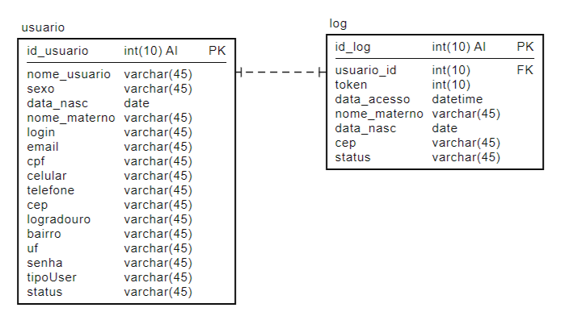
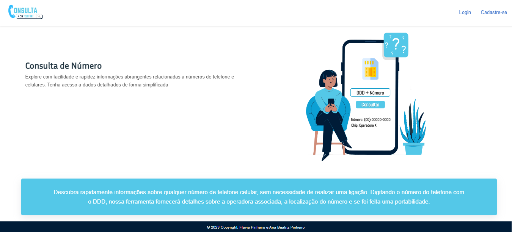
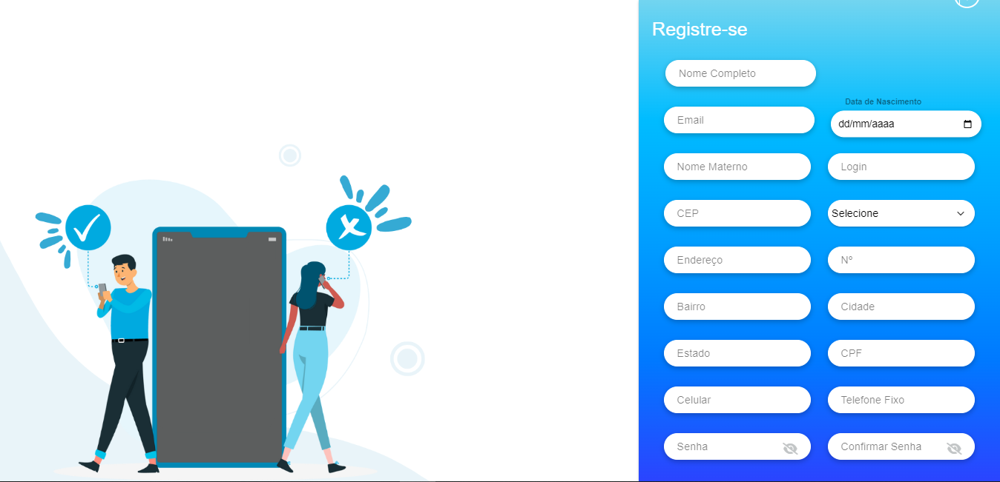
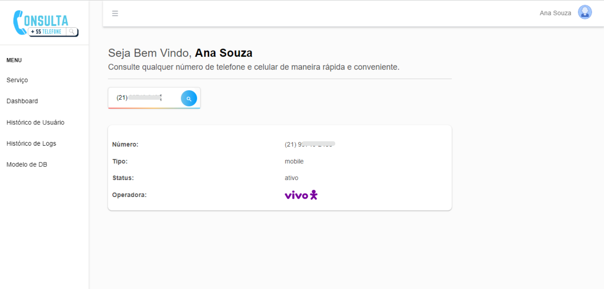
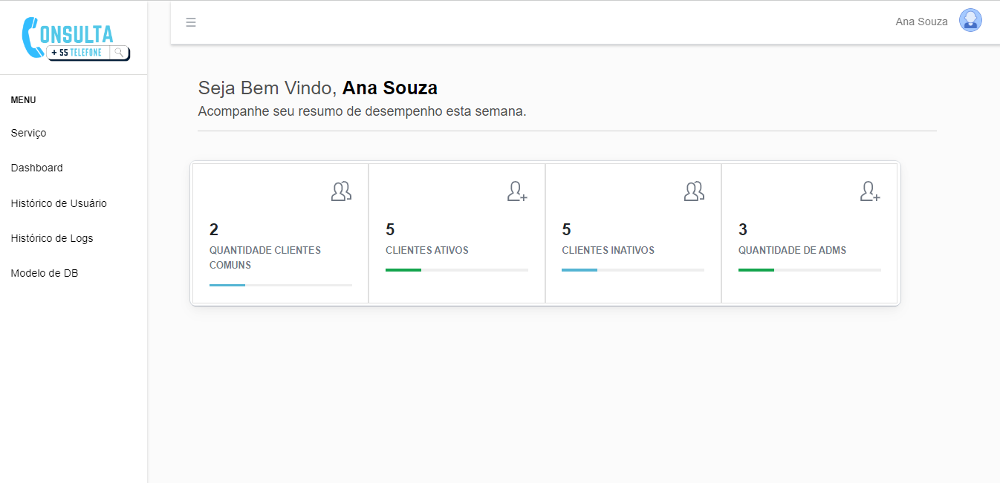
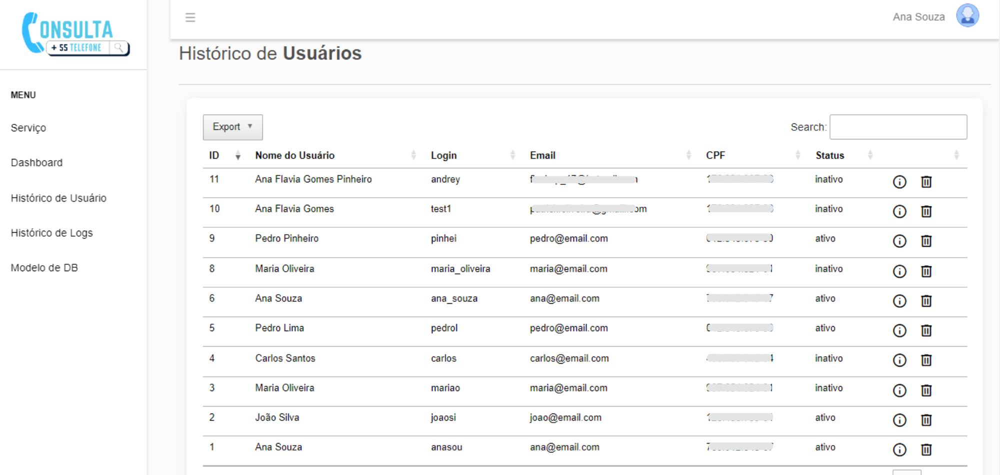
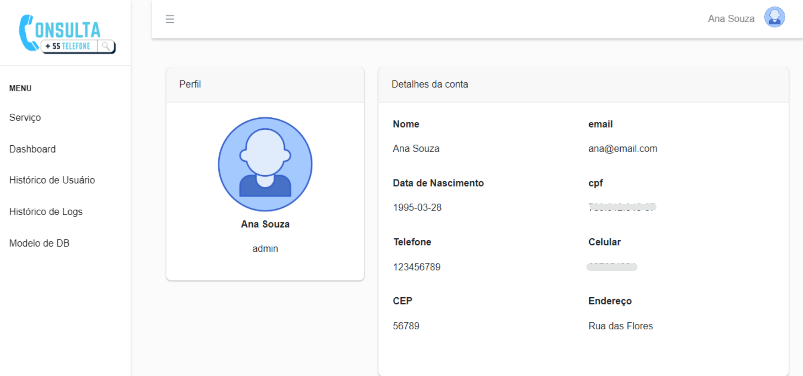

## Introdução

Projeto Acadêmico de Sistema de Gerenciamento de Usuários baseado na arquitetura MVC, incluindo autenticação (2FA), autorização e integração com MySQL.
O sistema tem as seguintes telas: Login, 2FA, Home, Cadastro de Usuário e Alteração de Senha, Dashboard, Serviço de Consulta Número,Relatório de Log e Usuário e Perfil.
Além disso, um sistema responsivo, utilizando javascript, html, css, bibliotecas como bootastrap e datatable no front-end e o desenvolvimento do back end com PHP.


## Banco de dados

1. Abra o arquivo `.config.php` do projeto.

2. Localize as configurações de banco de dados no arquivo `.config.php`. Elas devem se parecer com isto:

   ```plaintext
    //Mysql
    $dbDrive = 'mysql';
    $dbhost = 'localhost';
    $dbUsername = 'root';
    $dbPassword = '';
    $dbName = 'gp_03_consultanumero';

## Cria a tabela de usuários
```sql
-- Criação da tabela de usuários
CREATE TABLE `gp_03_consultanumero`.`usuario` (
  `id_usuario` INT NOT NULL AUTO_INCREMENT,
  `nome_usuario` VARCHAR(45) NOT NULL,
  `sexo` VARCHAR(45) NULL,
  `data_nasc` DATE NOT NULL,
  `nome_materno` VARCHAR(45) NOT NULL,
  `login` VARCHAR(45) NOT NULL,
  `email` VARCHAR(45) NOT NULL,
  `cpf` VARCHAR(45) NOT NULL,
  `celular` VARCHAR(45) NULL,
  `telefone` VARCHAR(45) NULL,
  `cep` INT NOT NULL,
  `logradouro` VARCHAR(45) NULL,
  `bairro` VARCHAR(45) NULL,
  `uf` VARCHAR(45) NULL,
  `senha` VARCHAR(45) NOT NULL,
  `tipoUser` VARCHAR(45) NOT NULL,
  `status` VARCHAR(45) NOT NULL,
  PRIMARY KEY (`id_usuario`));

-- Inserção de registros na tabela
INSERT INTO usuario (nome_usuario, sexo, data_nasc, nome_materno, login, email, cpf, celular, telefone, cep, logradouro, bairro, uf, senha, tipoUser, status)
VALUES 
('Ana Souza', 'Feminino', '1995-03-28', 'Souza', 'ana_souza', 'ana@email.com', '789.012.345-67', '987654321', '123456789', 56789, 'Rua das Flores', 'Jardim Primavera', 'RS', 'senhaabc', 'admin', 'ativo'),
('Pedro Lima', 'Masculino', '1982-06-05', 'Lima', 'pedro_lima', 'pedro@email.com', '012.345.678-90', '987654321', '123456789', 67890, 'Avenida dos Pássaros', 'Parque dos Sonhos', 'BA', 'senhadef', 'comum', 'inativo');

-- Criação da tabela de log
CREATE TABLE `gp_03_consultanumero`.`log` (
  `id_log` INT NOT NULL AUTO_INCREMENT,  
  `usuario_id` INT NOT NULL,
  `status` VARCHAR(45) NOT NULL,
  `descricao` VARCHAR(45) NOT NULL,
  `data_log` TIMESTAMP DEFAULT CURRENT_TIMESTAMP,
  PRIMARY KEY (`id_log`),
  CONSTRAINT FK_LogUsuario FOREIGN KEY (`usuario_id`) REFERENCES `usuario`(`id_usuario`)
);

INSERT INTO log (usuario_id, status, data_log, descricao)
VALUES 
('1', 'ativo', '2023-11-26 19:25:28', 'Usuário admin foi logado.'),
('2', 'ativo', '2023-11-25 19:23:28', 'O usuário ana (ID: 2) utilizou a autenticação de dois fatores.');


-- Criação da tabela de _2fa
CREATE TABLE `gp_03_consultanumero`.`_2fa` (
  `id_2fa` INT NOT NULL AUTO_INCREMENT,  
  `2fa_quest` VARCHAR(45) NOT NULL,
  PRIMARY KEY (`id_2fa`));

INSERT INTO _2fa (2fa_quest)
VALUES
('Qual o nome da Mãe?'),
('Digite seu CEP?'),
('Digite sua data de nascimento?');


```
## Diagrama de entidade de relacionamento


## Página Home
<span>A página inicial proporciona uma visão geral das informações essenciais sobre o serviço em questão. Este ponto de entrada fornece um resumo claro e fácil de entender dos principais elementos do sistema, oferecendo uma base informativa para os usuários.</span><br>


## Página Registro
<span>A tela de registro foi cuidadosamente desenvolvida, seguindo à risca os requisitos delineados no documento. Cada campo passa por verificações, garantindo a integridade das informações inseridas. Recursos como a consulta à API ViaCep e a validação do Identificador de CPF são incorporados para garantir a validade dos dados, resultando na inserção efetiva no banco.</span><br>


## Página Login
<span>A tela de login segue rigorosamente os requisitos estabelecidos, com campos projetados para atender às especificações do documento. As senhas, limitadas a letras e com até 8 caracteres, e logins de até 6 caracteres passam por uma verificação no banco de dados para confirmar a autenticidade dos dados fornecidos.
</span><br>


## Página Serviço
<span>A tela destinada ao serviço de consulta telefônica incorpora o uso de uma API gratuita do veriphone.io, que fornece dados relacionados ao número pesquisado. Após o login, usuários comuns têm acesso restrito apenas à página de serviço e ao perfil.</span><br>


## Página Dashboard
<span>O dashboard oferece uma visão consolidada e analítica dos dados do usuário. Através da seleção de colunas específicas, são exibidas informações como a quantidade total de usuários, clientes ativos e inativos, obtidas por meio de consultas ao banco de dados.</span><br>


## Página Relatório de Usuários
<span>A tela de histórico de usuários apresenta uma tabela detalhada com informações específicas, permitindo a exclusão de registros e fornecendo opções para a obtenção de detalhes adicionais. Um recurso adicional permite exportar a tabela nos formatos CSV, PDF, Excel e também copiar os dados para a área de transferência.</span><br>


## Página Relatório de Logs
<span>A tabela de histórico de logs mapeia todas as interações realizadas pelos usuários no sistema, proporcionando uma ferramenta valiosa para análise. Assim como na tela de histórico de usuários, os usuários têm a capacidade de exportar os dados nos formatos CSV, PDF, Excel, ou copiá-los para a área de transferência.
</span><br>


## Página Perfil
<span>A tela de perfil oferece uma visão detalhada dos dados associados ao usuário logado. Este espaço apresenta de forma clara e organizada informações específicas relacionadas ao perfil do usuário, proporcionando uma experiência personalizada e intuitiva.</span><br>



